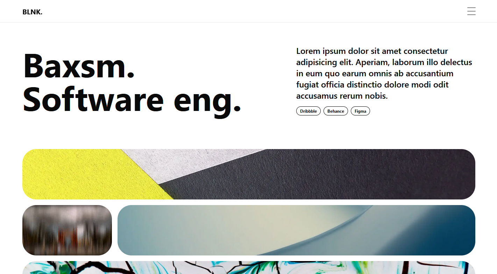

# 🌟 BLNK Portfolio with Next.js 🌟



Welcome to the BLNK Portfolio project! This is a dynamic and visually appealing personal portfolio website built using modern web technologies. 🚀 The website comprises several sections including Home, About, Work, Journal / Blog, and Contact, each designed to showcase your professional background and personal projects in an engaging manner. 💼✨

## ⚙️ Technology Stack

This project leverages:

- **Next.js**
  - A robust React framework for seamless navigation and server-side rendering.
- **App Router**
  - For intuitive routing and navigation.
- **Shadcn-ui**
  - A component library built on **Radix-ui**, ensuring consistent and accessible UI components.
- **TailwindCSS**
  - For elegant and streamlined styling.
  - **tailwind-merge** for streamlining class names.
  - **tailwindcss-animate** for smooth animations.
- **Framer Motion**
  - Providing advanced animation features.
- **Lucide-react**
  - Enhancing the visual appeal with versatile icons. 🎨

## 🚀 Running the Project

To run this project locally, follow these steps:

1. Clone the repository:

   ```bash
   git clone https://github.com/baxsm/blnk-portfolio-nextjs.git
   ```

2. Navigate to the project directory:

   ```bash
   cd blnk-portfolio-nextjs
   ```

3. Install the dependencies:

   ```bash
   npm install
   ```

4. Start the development server:

   ```bash
   npm run dev
   ```

5. Open your browser and go to [http://localhost:3000](http://localhost:3000) to see the project running. 🎉
